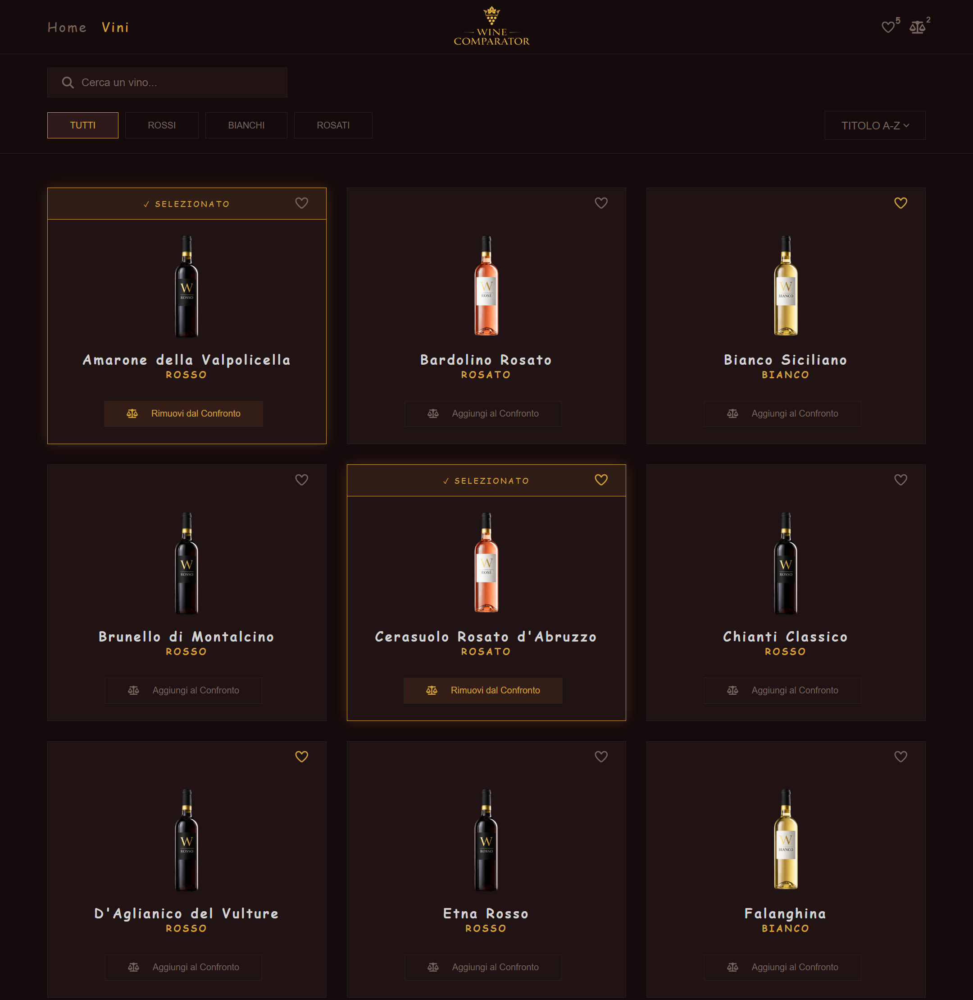
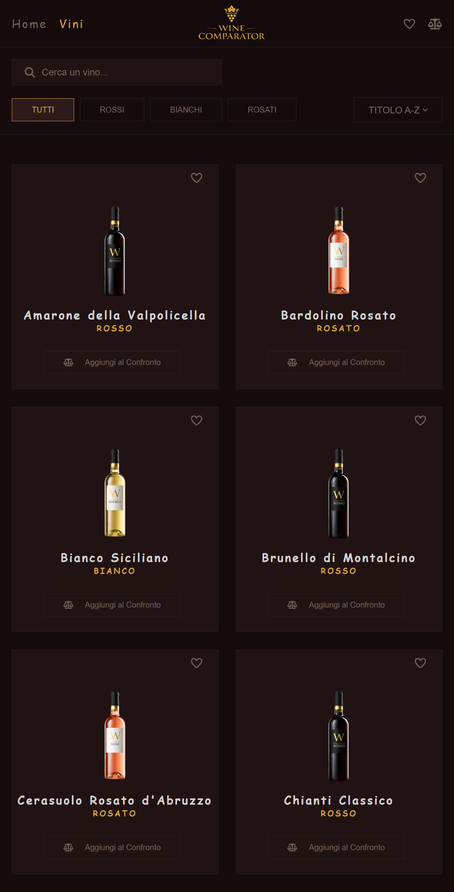
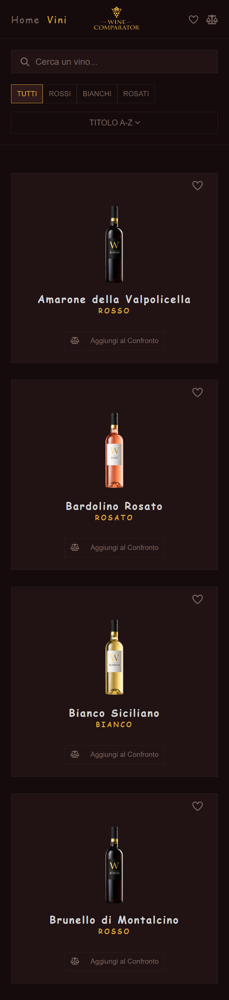

<h1 align="center">🍷 Wine Comparator</h1>

**Wine Comparator** è una Single Page Application (SPA) sviluppata con **React** che consente di:

- visualizzare una lista di vini;
- consultare i dettagli di ogni vino;
- salvare vini nei preferiti;
- confrontare due vini selezionati.

L'applicazione include funzionalità di ricerca, filtro e ordinamento dei dati.

Il frontend comunica con un backend REST sviluppato con Node.js ed Express per la gestione della risorsa `Wine`.

Backend repository:  
[wine-comparator-backend](https://github.com/Damiana-Arangio/wine-comparator-backend)

---

## 🎥 Demo

<p>
  
</p>

---

## 📱 Responsive Design

### Wines Page - Desktop


### Wines Page - Tablet


### Wines Page - Smartphone


---

## ✨ Funzionalità Principali

- Ricerca vini con debounce
- Filtri per categoria (rosso, bianco, rosato)
- Ordinamento per titolo (A-Z / Z-A)
- Gestione vini preferiti con persistenza tramite `localStorage`
- Confronto tra due vini tramite modale
- Pagina dettaglio di un singolo vino
- Gestione stati vuoti (nessun risultato / preferiti vuoti)
- Pagina 404 personalizzata
- Layout responsive per desktop, tablet e smartphone

---

## ⚙️ Implementazione Tecnica

- Debounce per ottimizzare le chiamate API
- `useMemo` per evitare ricalcoli inutili
- `useCallback` per stabilizzare le funzioni tra i render
- Context API per la gestione dello stato globale + custom hooks
- `localStorage` per la persistenza dei preferiti
- `React.memo` per ottimizzazione dei componenti renderizzati in lista

---

## 🛠️ Stack

- React
- React Router DOM
- Vite
- CSS
- Font Awesome
- Lucide Icons

---

## 🧩 Architettura dell'Applicazione

Lo schema seguente mostra la struttura principale dell'applicazione: i **Provider** che gestiscono i context globali, il **layout principale** organizzato con `Outlet` per il rendering dinamico delle pagine e i **componenti principali** utilizzati nelle diverse sezioni dell'app.

È inoltre presente una **modale di confronto**, accessibile da diverse pagine dell'applicazione, che permette di confrontare le caratteristiche di due vini selezionati.


---

## 🛠️ Setup del Progetto

### Installazione frontend

```bash
git clone https://github.com/Damiana-Arangio/wine-comparator-frontend.git
cd wine-comparator-frontend
npm install
npm run dev
```

Per avviare correttamente l'applicazione è necessario eseguire anche il backend disponibile nella repository dedicata.

---

## 👩‍💻 Damiana Arangio

Progetto finale – Specializzazione Frontend (Boolean)